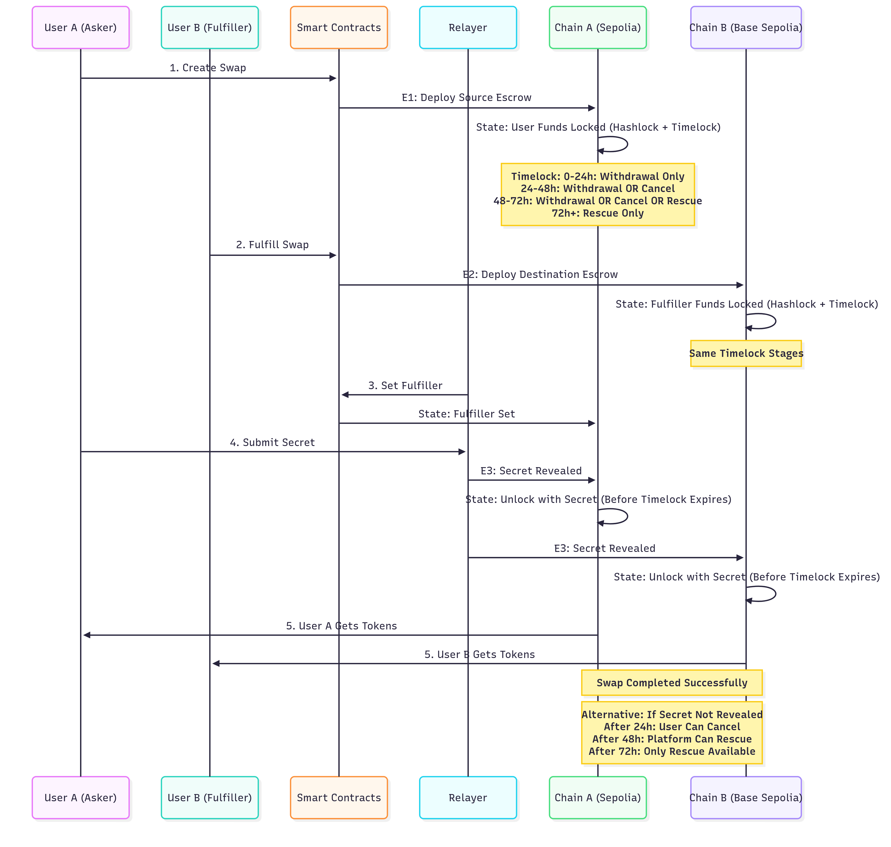
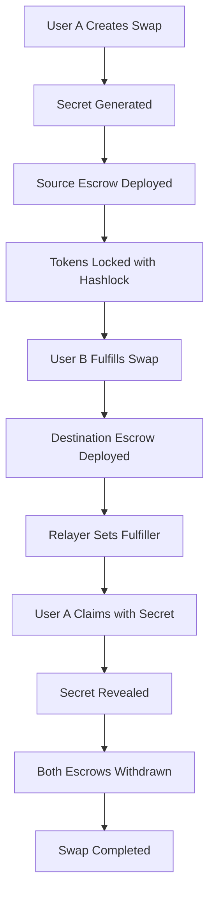

# PeerSwap - P2P Cross-Chain Swap Protocol



A trustless P2P swap platform where two users can securely exchange tokens across chains without DEXes or bridges.

## 🚨 The Problem

Meet **Mohit** and **Jack** - two crypto enthusiasts with a simple problem.

**Mohit** has 1000 USDC sitting on Base chain, but he really wants some **Tempo tokens** that are only available on the Tempo chain. He's been waiting for weeks, checking every DEX and bridge, but there's just no way to get Tempo tokens.

Meanwhile, **Jack** has plenty of Tempo tokens on Tempo chain, but he needs USDC on Base for his next DeFi play. He's also been searching everywhere - no bridges, no DEXes, nothing.

**The frustrating reality:**
- 🚫 **No direct bridge** between Base and Tempo chains
- 💸 **High slippage** on existing DEXes (if they even have the pair)
- 🏦 **Centralized exchanges** require KYC and take days
- 🤝 **No secure way** for Mohit and Jack to trade directly

They're literally perfect trading partners, but the infrastructure doesn't exist for them to help each other out. This is the **P2P swap gap** - millions of users with complementary needs, but no trustless way to connect them.

## 💡 The Solution

A trustless P2P swap platform where two users can securely exchange tokens across chains without DEXes or bridges.

- Uses hashlocked escrows + timelocks for security
- Relayer coordinates but never controls funds
- Works chain-to-chain, simple and effective

### Key Features
- **Trustless**: No dispute resolution needed
- **No middlemen**: Only lightweight relayer
- **Secure & fault-proof**: Cryptographic locks
- **Cross-chain compatible**
- **User-friendly**: Peer-to-peer experience

## 🏗️ Architecture

### Core Components

1. **Smart Contracts** (Solidity)
   - `EscrowFactory` - Main factory contract that deploys escrow instances
   - `EscrowSrc` - Source chain escrow contract that locks asker's tokens
   - `EscrowDst` - Destination chain escrow contract that locks fullfiller's tokens
   - `BaseEscrow` - Abstract base contract with common escrow functionality

2. **Backend Services** (Node.js/TypeScript)
   - Express API server for swap management
   - Relayer service for cross-chain coordination
   - Event monitoring and automatic processing
   - In-memory swap storage

3. **Frontend Application** (Next.js/React)
   - Farcaster Mini App interface
   - Wallet integration (Wagmi)
   - Real-time swap status tracking
   - Cross-chain transaction management

## 🔄 Technical Flow

1. **Create Swap** – User A locks funds in escrow (Hashlock + Timelock)
2. **Fulfill Swap** – User B locks funds on destination chain  
3. **Set Fulfiller** – Role is assigned
4. **Submit Secret** – Secret revealed to unlock funds
5. **Completion** – Both users receive tokens

### Fail-safes:
- **24h** → Cancel option
- **48h** → Rescue possible  
- **72h** → Only rescue available

## 🔄 Complete Swap Flow



## 🔐 Security Mechanisms

### Hashlock System
- **Secret Generation**: User generates a random secret
- **Hashlock Creation**: Secret is hashed using keccak256
- **One-way Function**: Prevents front-running and ensures atomic swaps
- **Secret Revelation**: Only the original secret can unlock tokens

### Timelock Stages

#### Source Chain
- `SrcWithdrawal`: Only asker can withdraw with secret (0-24h)
- `SrcPublicWithdrawal`: Anyone with access token can withdraw (24-48h)
- `SrcCancellation`: Only asker can cancel (24-48h)
- `SrcPublicCancellation`: Anyone with access token can cancel (48-72h)

#### Destination Chain
- `DstWithdrawal`: Only asker can withdraw with secret (0-24h)
- `DstPublicWithdrawal`: Anyone with access token can withdraw (24-48h)
- `DstCancellation`: Only fullfiller can cancel (24-48h)

### Cross-Chain Security
- **Atomic Operations**: Both escrows must succeed or both fail
- **Execution Data Validation**: All operations verify execution data integrity
- **Access Token Control**: Public functions require access token ownership
- **Emergency Recovery**: Rescue mechanism for stuck funds after 72h

## 💰 Fee Structure

- **Platform Fee**: 1% of asker amount (configurable, max 10%)
- **Gas Fee**: Native token fee paid by fullfiller, returned to withdrawal caller
- **Fee Collector**: Configurable address to receive platform fees

## 🛠️ Technical Implementation

### Smart Contract Features
- **Deterministic Addresses**: Using CREATE2 for predictable escrow addresses
- **Clone Pattern**: Gas-efficient deployment using OpenZeppelin Clones
- **SafeERC20**: Secure token transfers with proper error handling
- **Timelock Library**: Compact storage of time-based restrictions

### Backend Services
- **Event Monitoring**: Real-time blockchain event processing
- **Relayer Coordination**: Automated cross-chain transaction execution
- **Swap Storage**: In-memory database for swap state management
- **API Endpoints**: RESTful interface for frontend integration

### Frontend Features
- **Wallet Integration**: Support for multiple wallet providers
- **Chain Switching**: Automatic network switching for cross-chain swaps
- **Real-time Updates**: Live swap status tracking
- **Transaction Management**: Comprehensive transaction history

## 🎯 Use Cases

- **Secondary / pre-listing token markets**
- **Low fees, simple UX**
- **Swaps with friends/social circles**
- **Large trades possible without slippage/liquidity issues**

## 🚀 Demo

Available on:
- **Farcaster** - Mini App integration
- **Worldcoin** - Identity verification
- **Web App** - Direct browser access

**Live now:** [peerswap.vercel.app](https://peerswap.vercel.app)

## 🚀 Getting Started

### Prerequisites
- Node.js 18+
- Foundry (latest version)
- Solidity 0.8.20+

### Installation

1. **Clone the repository**
```bash
git clone <repository-url>
cd peerswap
```

2. **Install dependencies**
```bash
# Backend
cd backend
npm install

# Frontend
cd ../miniapp/peerswap
npm install

# Smart contracts
cd ../../peerswap-contracts
forge install
```

3. **Environment Setup**
```bash
# Backend
cp backend/.env.example backend/.env
# Configure your environment variables

# Frontend
cp miniapp/peerswap/.env.example miniapp/peerswap/.env.local
# Configure your environment variables
```

### Development

1. **Start the backend**
```bash
cd backend
npm run dev
```

2. **Start the frontend**
```bash
cd miniapp/peerswap
npm run dev
```

3. **Deploy smart contracts**
```bash
cd peerswap-contracts
forge script script/Deploy.s.sol --rpc-url <RPC_URL> --private-key <PRIVATE_KEY> --broadcast
```

### Testing

```bash
# Smart contracts
cd peerswap-contracts
forge test

# Backend
cd backend
npm test

# Frontend
cd miniapp/peerswap
npm test
```

## 📊 API Endpoints

### Swap Management
- `POST /swaps` - Create a new swap
- `GET /swaps` - List all swaps
- `GET /swap-status/:hashlock` - Check swap status
- `POST /claim` - Submit secret for claiming

### System Management
- `GET /health` - Health check
- `POST /check-deployments` - Check all swap deployments
- `GET /check-relayer` - Check relayer addresses

## 🔧 Configuration

### Environment Variables

#### Backend
- `RELAYER_PRIVATE_KEY` - Private key for relayer operations
- `PORT` - Server port (default: 8787)
- `RPC_URL_SEPOLIA` - Sepolia RPC endpoint
- `RPC_URL_BASE_SEPOLIA` - Base Sepolia RPC endpoint

#### Frontend
- `NEXT_PUBLIC_BACKEND_URL` - Backend API URL
- `NEXT_PUBLIC_FACTORY_ADDRESS_SEPOLIA` - Sepolia factory address
- `NEXT_PUBLIC_FACTORY_ADDRESS_BASE_SEPOLIA` - Base Sepolia factory address

## 🌐 Supported Networks

- **Ethereum Sepolia** (Chain ID: 11155111)
- **Base Sepolia** (Chain ID: 84532)

## 🔒 Security Considerations

- **Private Key Management**: Never expose private keys in client-side code
- **Access Token Requirements**: Public functions require access token ownership
- **Timelock Enforcement**: Operations only available after specific time periods
- **Emergency Recovery**: Rescue mechanism for stuck funds
- **Gas Fee Protection**: Gas fees are returned to withdrawal callers

## 📈 Performance Optimizations

- **Clone Pattern**: Gas-efficient contract deployment
- **Event-driven Architecture**: Real-time processing without polling
- **In-memory Storage**: Fast swap state management
- **Batch Operations**: Efficient multi-swap processing

## 🤝 Contributing

1. Fork the repository
2. Create a feature branch
3. Make your changes
4. Add tests for new functionality
5. Submit a pull request

## 📄 License

This project is licensed under the MIT License - see the LICENSE file for details.

## 🆘 Support

For support and questions:
- Create an issue in the repository
- Join our community discussions
- Check the documentation for common solutions

## 🔮 Future Additions

- [ ] **Private P2P swaps**
- [ ] **Integrations with WhatsApp, Telegram, etc.**
- [ ] **P2P Net Swaps (multi-party settlements)**
- [ ] Support for additional blockchain networks
- [ ] Mobile application development
- [ ] Enhanced security features
- [ ] Governance token integration

---

**Built with ❤️ for the decentralized future**
